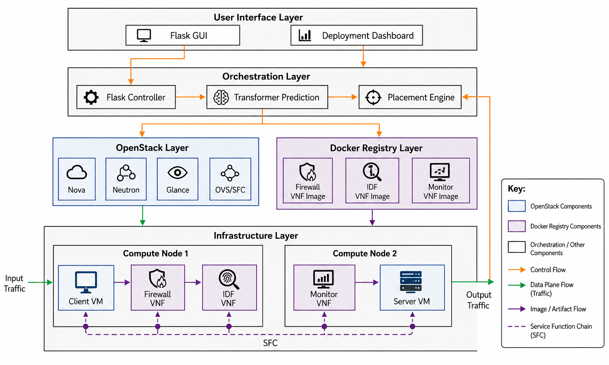
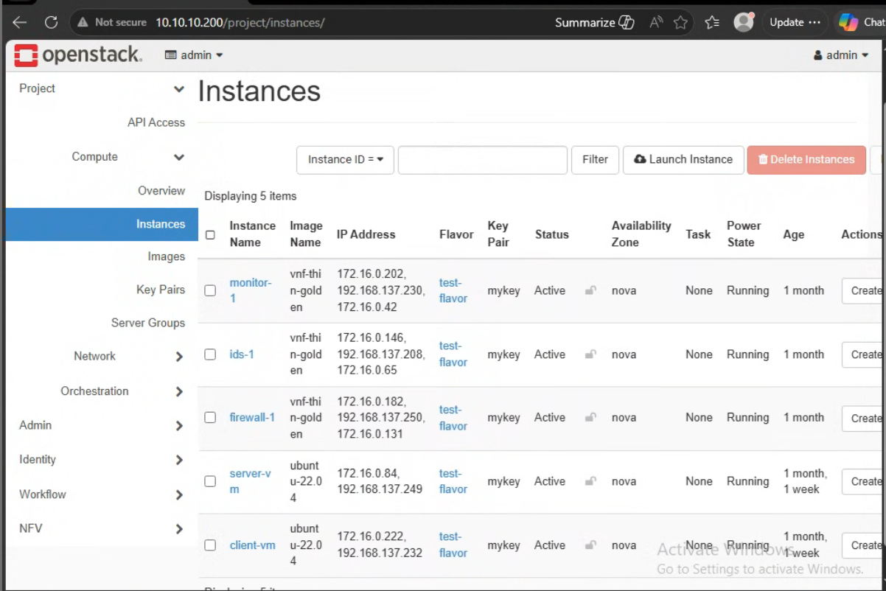
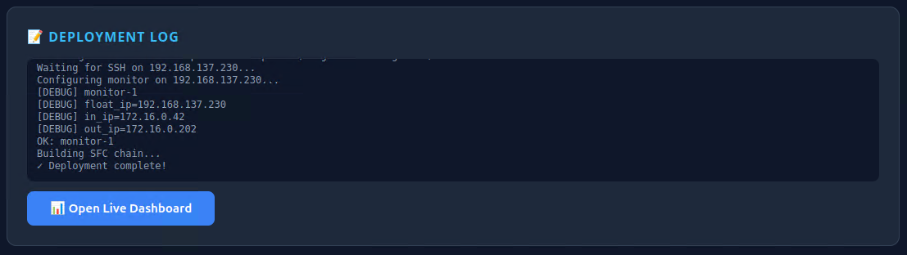

# OpenStack Dynamic Service Function Chaining (SFC) Orchestrator

An intelligent, hybrid VNF (Virtual Network Function) orchestrator and **Transformer-based predictive placement engine** built on **OpenStack Dalmatian (2024.2)**. This platform automates the provisioning, dynamic placement, and packet steering of containerized security functions (Firewall, IDS, Monitor) inside lightweight host VMs.

---

## 🛠️ What is this?
Traditional Network Function Virtualization (NFV) relies on heavy, monolithic virtual appliances that suffer from slow boot times, high resource footprints, and rigid placement. 

This platform implements a **hybrid container-on-VM architecture**:
- **Lightweight host VMs** (`vnf-thin-golden`) are spawned dynamically on compute nodes, pre-configured with Docker and routing rules.
- **VNF Logic** runs inside lightweight, highly optimized containers launched inside the host VMs.
- **Traffic Steering** is handled transparently by OpenStack's Neutron SFC API, routing packets through a sequence of Port Pairs, Port Pair Groups, and Flow Classifiers.
- **Predictive Transformer Scheduling** forecasts compute host resource capacities using a deep learning self-attention model trained on VM metrics.

---

## 🌟 Key Features
- **Transformer Predictive Placement**: A PyTorch-based sequence-to-scalar Transformer model that forecasts next-hour CPU utilization for hypervisors.
- **Dynamic SFC Orchestration**: Full lifecycle automation of Port Pairs, Port Pair Groups, Flow Classifiers, and Port Chains.
- **Dynamic VNF Tooling**: Built-in containerized Firewall (stateful iptables), IDS (Scapy threat signature scanner), and Monitor (throughput and traffic log logger).
- **Interactive Dashboards**: Deployment console with telemetry graphs, packet stream logs, security alerts, and a traffic generator.

---

## 📐 System Architecture

Traffic originating from a Client VM is intercepted, steered sequentially through the active VNF service chain, and delivered to the Web Server VM.




---

## 🔄 Orchestration Workflow

The orchestrator manages the lifecycle of the service chain using the following end-to-end flow:


1. **VNF Chain Definition**: The user selects the desired VNF types (Firewall, IDS, Monitor) and the chain sequence from the Flask dashboard.
2. **Predictive Placement**: The orchestrator polls live hypervisor telemetry and uses the Transformer forecasting model to predict next-hour CPU load, selecting the hosts with the most forecasted capacity.
3. **Host VM Provisioning**: The orchestrator boots thin golden VM instances (`vnf-thin-golden`) on the chosen OpenStack compute nodes.
4. **SSH Bootstrap Connection**: Once the VM status shifts to active, the orchestrator establishes SSH sessions to start container management.
5. **VNF Docker Pull & Run**: The host VM downloads the VNF container image from the private Docker registry and launches it in the Docker runtime.
6. **Neutron SFC Provisioning**: The orchestrator configures OpenStack Neutron SFC resources (Port Pairs, Port Pair Groups, Flow Classifiers, and Port Chains) to steer traffic dynamically through the deployed VNF containers.

---

## 📂 Repository Structure

```text
Github_SFC/
├── orchestrator/            # Flask Web Orchestrator
│   ├── core/                # Orchestrator Python modules
│   │   ├── placement.py     # TransformerPredictor forecasting model
│   │   ├── transformer_model.pth # Pre-trained Transformer model weights
│   │   ├── norm_params_per_host.npy # Pre-compiled Min-Max normalization limits
│   │   ├── metrics.py       # Metrics scraper API
│   │   ├── openstack_ops.py # OpenStack SDK controller operations
│   │   └── sfc_ops.py       # Neutron SFC CLI controller wrapper
│   ├── templates/           # Web UI templates (dashboard, deployment panel)
│   ├── app.py               # Main Flask application
│   ├── config.py            # Credentials, networks, and images configuration
│   └── requirements.txt     # Python requirements
├── vnf_containers/          # Containerized VNF source code
│   ├── firewall/            # Dockerfile and firewall iptables logic
│   ├── ids/                 # Dockerfile and scapy intrusion detection
│   └── monitor/             # Dockerfile and scapy throughput tracker
├── model_training/          
│   ├── plots/               
│   ├── preprocess.py        
│   ├── train.py             
│   ├── transformer_cpu_best.pth 
│   
└── screenshots/            
```

---

## 🧠 Transformer Predictive Placement Engine
The scheduling core (`core/placement.py`) leverages a **Time-Series CPU Forecasting Transformer Model** (`TransformerPredictor` in PyTorch) to make placement decisions.

### How it works:
1. **Load Forecasting**: The model consumes a 24-hour sequence of historical CPU utilization for each host.
2. **Transformer Encoder**: The sequence is passed through 2 Transformer Encoder layers with 4 attention heads to learn long-term workload patterns.
3. **Future Prediction**: The model forecasts the next-hour CPU utilization of each hypervisor.
4. **Resource Scoring**: The predicted load is balanced alongside RAM usage and VNF density to determine the target compute node.
5. **Pre-trained Weights & Fallback**: The engine automatically loads your pre-trained weights (`transformer_model.pth`) and normalization limits (`norm_params_per_host.npy`). If PyTorch is missing, the code runs a NumPy-based prediction simulation, ensuring the application remains runnable on any machine.

---

## 📦 VNF Specifications

The system utilizes three containerized Virtual Network Functions (VNFs) to inspect and secure traffic:

* **🛡️ Firewall VNF (`vnf_containers/firewall/`)**: Configures stateful packet filtering inside the kernel namespace. It sets a default `DROP` policy on the forwarding chain, permitting only established/related TCP sessions and limiting incoming traffic exclusively to Port `80` (HTTP).
* **🔍 Intrusion Detection System VNF (`vnf_containers/ids/`)**: Sniffs traffic asynchronously using Scapy. It scans packet headers and payloads for SQL injections (e.g., `UNION SELECT`), Cross-Site Scripting (XSS), and Nmap-style TCP Syn port scans, triggering alerts immediately to the main dashboard.
* **📡 Monitor VNF (`vnf_containers/monitor/`)**: Tracks connection stats, logging throughput bandwidth (kbps), active connection counts, and packet payloads. It exposes these metrics via a thread-safe HTTP API on port `8080` for telemetry scraping.

---

## 🔌 Core OpenStack SFC CLI Commands

The orchestrator automates the following Neutron SFC commands to create the service chains:

1. **Port Pairs**: Link OpenStack VM ports to active VNF slots:
   ```bash
   openstack sfc port pair create --ingress <in_port> --egress <out_port> vnf_port_pair
   ```
2. **Port Pair Groups**: Pool multiple port pairs together for load balancing and redundancy:
   ```bash
   openstack sfc port pair group create --port-pair vnf_port_pair vnf_port_pair_group
   ```
3. **Flow Classifiers**: Define what traffic should be steered (e.g., all TCP traffic from client IP pointing to port 80):
   ```bash
   openstack sfc flow classifier create \
     --eth-type IPv4 \
     --protocol tcp \
     --source-ip-prefix 172.16.0.10/32 \
     --destination-port 80 \
     vnf_flow_classifier
   ```
4. **Port Chains**: Link the groups and classifiers to establish the path:
   ```bash
   openstack sfc port chain create \
     --port-pair-group vnf_port_pair_group \
     --flow-classifier vnf_flow_classifier \
     vnf_port_chain
   ```

---

## 🖥️ Graphical Showcase

### Openstacck


### Live Telemetry Dashboard
Visualizes the active chain topology, live CPU metrics per VNF, blocked threats (IDS alerts), and recent packet streams.


---
