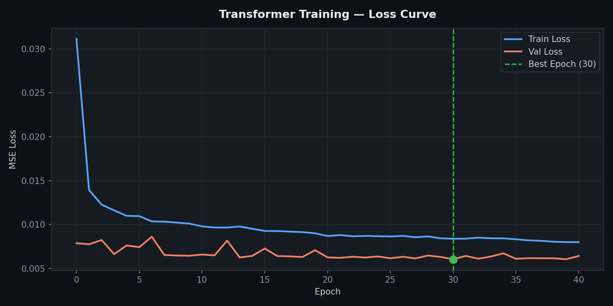
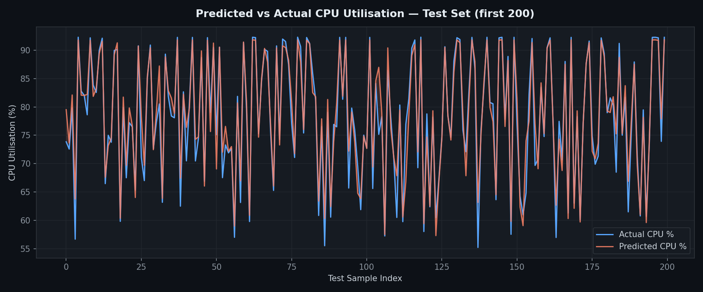
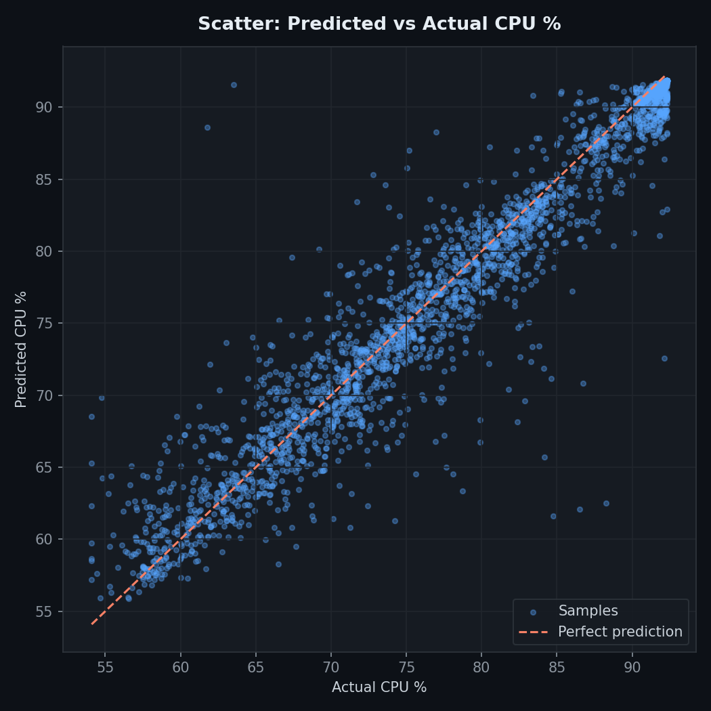

# SAP Cloud Infrastructure — CPU Load Forecasting Pipeline
### Transformer-based Prediction for Optimised SFC Placement on OpenStack

---

## Overview

This report documents the end-to-end pipeline built to preprocess telemetry data from the **SAP Cloud Infrastructure Dataset (IMC 2025)** and train a **Transformer model** to forecast future CPU utilisation on OpenStack compute hosts (hypervisors). The trained model acts as the **load oracle** for an upcoming Reinforcement Learning (RL) agent that will optimise **Service Function Chain (SFC) placement**.

---

## Dataset

| Property | Value |
|----------|-------|
| **Source** | SAP Cloud Infrastructure Dataset (IMC 2025) |
| **File** | `vrops_compute_host_cpu_usage_capacity_all.csv` |
| **Duration** | 30 days (2024-08-15 → 2024-09-14) |
| **Total Rows** | 9,055,989 |
| **Columns** | `Timestamp`, `Value` (CPU %), `Host`, `BB` |
| **Granularity** | 5-minute intervals per entity |

---

## Part 1 — Data Preprocessing (`preprocess.py`)

### Step 1 — Load & Clean

- Parsed `Timestamp` as `datetime`
- Dropped rows with `null` or negative `Value`
- Sorted ascending by `Timestamp`

### Step 2 — Per-Host Approach (Key Fix)

The dataset contains two identifier columns:
- `Host` — specific compute node (e.g. `node001-bb001`) — **269 unique nodes**, but ~85% rows have null Host
- `BB` — building block (e.g. `bb001`) — **97 unique BBs**, aggregated level

**Problem with naive BB grouping:** Grouping by `BB` and taking the mean across all nodes inside a building block smoothed out variance drastically, producing a system-wide std of only **1.03%** and just **287 training sequences** — far too few and too flat for a Transformer.

**Fix:** Created a composite `Entity` column:
```python
df['Entity'] = df['Host'].fillna(df['BB'])
```
This gives **366 unique entities**, preserving the variance of individual nodes.

Each entity's series was:
1. Resampled to **1-hour intervals** (mean aggregation)
2. Forward-filled up to **2 consecutive gaps**
3. Dropped if fewer than **100 timesteps** remained
4. Filtered: only entities with **std > 5%** were kept

| Filter | Count |
|--------|-------|
| Total entities | 366 |
| With ≥ 100 hourly timesteps | ~150 |
| **With std > 5% (qualifying)** | **38** |

### Step 3 — Per-Host Normalisation & Sequence Building

Each qualifying host's series was independently normalised using its own min/max:

```
value_norm = (value - v_min) / (v_max - v_min)
```

Sliding window sequences (no shuffling, no cross-host spanning):
- `SEQ_LEN = 24` (24 hours of history → predict hour 25)
- **13,642 total sequences** collected across 38 hosts

### Step 4 — Time-Based Split (80/20)

All sequences sorted by source timestamp, then split:

| Split | Shape |
|-------|-------|
| `X_train` | **(10,913 × 24)** |
| `X_test`  | **(2,729 × 24)**  |
| `y_train` | (10,913,) |
| `y_test`  | (2,729,) |

### Validation Results

```
Hosts with std > 5:        38   ✅ > 10
X_train shape:             (10913, 24)  ✅ N > 1000
X_test shape:              (2729, 24)
Value range:               [0.0, 1.0]  ✅
Any NaN:                   False  ✅
Overall std across all seq: 0.2674  ✅ > 0.1
```

### Saved Files

| File | Description |
|------|-------------|
| `X_train.npy` | Training sequences |
| `X_test.npy` | Test sequences |
| `y_train.npy` | Training targets |
| `y_test.npy` | Test targets |
| `norm_params_per_host.npy` | Per-host `[vmin, vmax]` for denormalisation |
| `host_stds.npy` | Per-entity standard deviations |
| `timestamps.npy` | Source timestamps for plotting |

---

### Figure 1 — Per-Host CPU Std Distribution


The red dashed line at std = 5 is the filter threshold. Entities to the right were included in training. The distribution peaks around 8–12%, confirming meaningful variance in individual host signals.

---

### Figure 2 — Sequence Data Distribution (Train & Test)


Both train and test sets span the full normalised range [0, 1] with similar multi-modal distributions, reflecting the diversity across 38 hosts.

---

## Part 2 — Transformer Training (`train.py`)

### Model Architecture

```
TransformerPredictor
├── Input Projection:    Linear(1 → 64)
├── Positional Encoding: Sinusoidal, seq_len=24
├── TransformerEncoder:  2 layers, 4 heads, d_ff=128
│   └── TransformerEncoderLayer (batch_first=True)
├── Dropout:             0.1
└── Output Head:         Linear(64 → 1)

Total parameters: 67,137
```

The model takes a 24-step normalised CPU sequence as input and predicts the value at step 25.

### Training Configuration

| Hyperparameter | Value |
|----------------|-------|
| Batch size | 64 |
| Epochs (max) | 50 |
| Optimizer | Adam, lr=0.001 |
| Scheduler | ReduceLROnPlateau (patience=5, factor=0.5) |
| Loss function | MSELoss |
| Early stopping | patience=10 |
| Device | CPU |

### Training History (All Epochs)

| Epoch | Train Loss | Val Loss | RMSE (%) |
|-------|-----------|---------|----------|
| 0 | 0.03113 | 0.00788 | 3.39% |
| 3 | 0.01161 | 0.00663 | 3.11% |
| 7 | 0.01033 | 0.00653 | 3.09% |
| 9 | 0.01010 | 0.00645 | 3.07% |
| 13 | 0.00978 | 0.00625 | 3.02% |
| 18 | 0.00914 | 0.00630 | 3.03% |
| 21 | 0.00880 | 0.00621 | 3.01% |
| **30** | **0.00838** | **0.00604** | **2.97% ← Best** |
| 39 | 0.00800 | 0.00605 | 2.97% |
| 40 | 0.00800 | 0.00642 | 3.06% — Early Stop |

Early stopping triggered at epoch **40** (no improvement for 10 consecutive epochs after best at epoch 30).

---

### Figure 3 — Training & Validation Loss Curve



Train loss decreases steadily throughout. Val loss converges around epoch 9 and stabilises in the 0.006–0.008 range. The green dashed line marks the best epoch (30).

---

### Figure 4 — Validation RMSE per Epoch (Real CPU %)


RMSE dropped from **3.39%** at epoch 0 to a best of **2.97%** at epoch 30 — well below the 15% acceptance threshold (red dashed line).

---

## Part 3 — Evaluation Results

### Final Metrics

| Metric | Value | Target |
|--------|-------|--------|
| **Best Val Loss** | 0.00604 | — |
| **Final RMSE** | **2.97%** | < 15% ✅ |
| **MAE** | **1.83%** | — |
| Best Epoch | 30 / 50 | — |
| Early Stop Epoch | 40 | — |
| Total Parameters | 67,137 | — |

### Sample Predictions (Last 5 Test Samples)

| Predicted | Actual | Error |
|-----------|--------|-------|
| 78.1% | 82.3% | −4.2% |
| 68.7% | 70.2% | −1.5% |
| 91.0% | 92.3% | −1.3% |
| 91.3% | 91.8% | −0.5% |
| 91.1% | 91.8% | −0.7% |

---

### Figure 5 — Predicted vs Actual CPU Utilisation (First 200 Test Samples)



The model tracks the actual CPU load closely. The shaded region shows the prediction error — narrow across most of the test set, with occasional divergences during rapid transitions.

---

### Figure 6 — Prediction Error Distribution


Errors are approximately zero-centred with a tight distribution. The slight negative skew indicates the model marginally under-predicts during high-load spikes — a conservative bias that is acceptable for SFC placement decisions.

---

### Figure 7 — Scatter: Predicted vs Actual CPU %



Points cluster tightly along the ideal diagonal (red dashed line), confirming strong predictive accuracy across the full CPU utilisation range.

---

## Saved Model Files

| File | Description |
|------|-------------|
| `transformer_cpu.pth` | Final model weights |
| `transformer_checkpoint.pth` | Full checkpoint with architecture config |
| `transformer_cpu_best.pth` | Best epoch snapshot (epoch 30) |

---

## What's Next — RL-Based SFC Placement

The trained Transformer serves as the **load forecasting oracle** for the RL pipeline:

```
┌─────────────────────┐     predicted CPU load      ┌─────────────────┐
│  Transformer Model  │ ─────────────────────────►  │   RL Agent      │
│  (trained, frozen)  │                              │  (DQN / PPO)    │
└─────────────────────┘                              └────────┬────────┘
                                                              │ SFC placement action
                                                              ▼
                                                    ┌─────────────────┐
                                                    │  OpenStack Nova │
                                                    │  Placement API  │
                                                    └─────────────────┘
```

**Upcoming steps:**
1. Build OpenStack gym environment using Nova API + placement telemetry
2. Define reward function: penalise overloaded hosts, reward balanced placement
3. Train DQN/PPO agent using Transformer predictions as state features
4. Evaluate SFC placement quality vs baseline (round-robin / first-fit)
